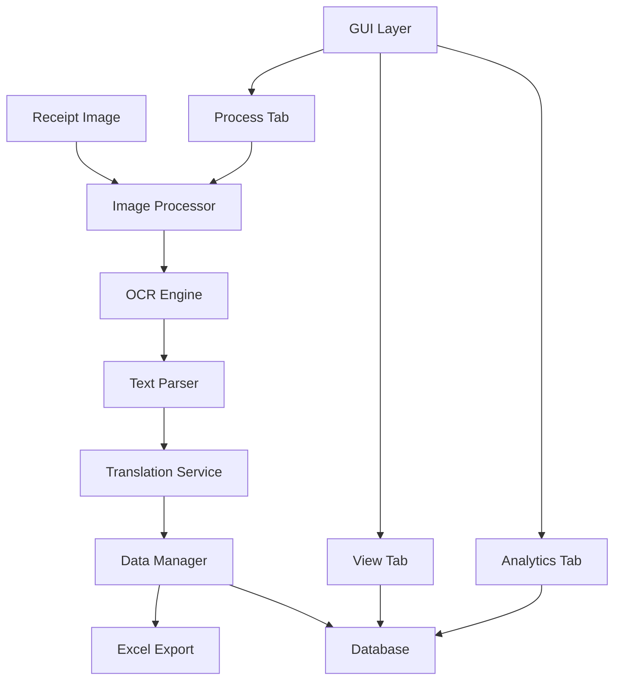

# 🧾 Receipt Processing App

<div align="center">


**Automate your expense tracking with AI-powered receipt processing**

[Features](#features) • [Installation](#installation) • [Usage](#usage) • [Screenshots](#screenshots) • [Contributing](#contributing)

</div>

---

## 📋 Table of Contents

- [Overview](#overview)
- [Features](#features)
- [Architecture](#architecture)
- [Installation](#installation)
- [Usage](#usage)
- [Screenshots](#screenshots)
- [Configuration](#configuration)
- [API Documentation](#api-documentation)
- [Testing](#testing)
- [Contributing](#contributing)
- [Troubleshooting](#troubleshooting)
- [License](#license)

---

## 🎯 Overview

The **Receipt Processing App** is a powerful desktop application that automates expense tracking by processing receipt images using OCR (Optical Character Recognition) technology. Originally designed for Dutch receipts, it automatically translates items to English and stores them in a searchable database.

### 🌟 Why This App?

- **Save Time**: No more manual data entry from receipts
- **Reduce Errors**: Automated text extraction eliminates typing mistakes  
- **Track Expenses**: Comprehensive analytics and reporting features
- **Multi-language**: Automatic Dutch to English translation
- **Export Ready**: Generate Excel reports for accounting or personal use

---

## ✨ Features

### 🖼️ **Image Processing**
- **Smart OCR**: Advanced text extraction using Tesseract
- **Image Preprocessing**: Automatic image enhancement for better recognition
- **Multiple Formats**: Support for PNG, JPG, JPEG, BMP, TIFF
- **Error Correction**: Manual editing tools for OCR mistakes

### 🌐 **Translation & Localization**
- **Auto-Translation**: Dutch to English using Google Translate API
- **Fallback Support**: Graceful handling of translation failures
- **Language Detection**: Automatic source language identification
- **Custom Translations**: Manual override capabilities

### 💾 **Data Management**
- **SQLite Database**: Reliable local data storage
- **Excel Export**: Generate spreadsheets for external use
- **Data Validation**: Ensure data integrity and accuracy
- **Backup Support**: Easy data export and import

### 📊 **Analytics & Reporting**
- **Expense Summaries**: Total spending by store and category
- **Monthly Reports**: Track spending trends over time
- **Category Analysis**: Understand spending patterns
- **Store Comparison**: Compare expenses across different retailers

### 🎨 **User Interface**
- **Intuitive Design**: Clean, modern tabbed interface
- **Real-time Preview**: See processed results immediately
- **Drag & Drop**: Easy image loading (coming soon)
- **Responsive Layout**: Works on different screen sizes

---

## 🏗️ Architecture

### System Design



### Component Overview

| Component | Responsibility | Technology |
|-----------|---------------|------------|
| `ImageProcessor` | OCR and image handling | OpenCV, Tesseract |
| `TranslationService` | Language translation | Google Translate API |
| `DatabaseManager` | Data persistence | SQLite |
| `DataManager` | Export and validation | Pandas |
| `GUI Classes` | User interface | Tkinter |

---

## 🚀 Installation

### Prerequisites

- **Python 3.8+** (Required)
- **Tesseract OCR** (Required for text extraction)
- **Internet Connection** (Required for translation)

### Quick Setup

#### 1️⃣ Clone the Repository
```bash
git clone https://github.com/yourusername/receipt-processing-app.git
cd receipt-processing-app
```

#### 2️⃣ Create Virtual Environment
```bash
# Windows
python -m venv receipt_env
receipt_env\Scripts\activate

# macOS/Linux
python3 -m venv receipt_env
source receipt_env/bin/activate
```

#### 3️⃣ Install Python Dependencies
```bash
pip install -r requirements.txt
```

#### 4️⃣ Install Tesseract OCR

<details>
<summary><b>Windows Installation</b></summary>

1. Download Tesseract from [UB Mannheim](https://github.com/UB-Mannheim/tesseract/wiki)
2. Install to default location: `C:\Program Files\Tesseract-OCR\`
3. Add to PATH or update config file

```python
# In config/settings.py
TESSERACT_PATH = r'C:\Program Files\Tesseract-OCR\tesseract.exe'
```

</details>

<details>
<summary><b>macOS Installation</b></summary>

```bash
# Using Homebrew
brew install tesseract
brew install tesseract-lang  # For additional languages
```

</details>

<details>
<summary><b>Linux Installation</b></summary>

```bash
# Ubuntu/Debian
sudo apt-get update
sudo apt-get install tesseract-ocr tesseract-ocr-nld tesseract-ocr-eng

# CentOS/RHEL
sudo yum install tesseract tesseract-langpack-nld tesseract-langpack-eng
```

</details>

#### 5️⃣ Run the Application
```bash
python main.py
```

---

## 📖 Usage

### Getting Started

#### 1. **Process Your First Receipt**

1. Launch the application
2. Go to the **"Process Receipt"** tab
3. Click **"Load Image"** and select a receipt photo
4. Click **"Process Receipt"** to extract items automatically
5. Review and edit items if needed
6. Click **"Save to Database"** to store the data

#### 2. **View Your Data**

1. Switch to the **"View Data"** tab
2. Click **"Refresh Data"** to see all stored receipts
3. Use filters to find specific receipts or date ranges
4. Export filtered data to Excel if needed

#### 3. **Analyze Your Spending**

1. Navigate to the **"Analytics"** tab
2. Click **"Generate Summary"** for overall statistics
3. Click **"Monthly Report"** for time-based analysis

### Advanced Features

#### Custom Categories
```python
# Add custom categories in config/settings.py
CUSTOM_CATEGORIES = [
    'Groceries', 'Dining Out', 'Transport', 'Healthcare',
    'Entertainment', 'Utilities', 'Shopping', 'Other'
]
```

#### Batch Processing
```python
# Process multiple images programmatically
from image_processor import ImageProcessor
from database import DatabaseManager

processor = ImageProcessor()
db = DatabaseManager()

for image_path in image_list:
    items = processor.process_receipt(image_path)
    db.save_receipt("Auto Store", "2024-01-01", items)
```

---

## 📸 Screenshots

### Main Interface

*Clean, tabbed interface for easy navigation*

### Receipt Processing

*Automatic item extraction and translation*

### Analytics Dashboard

*Comprehensive expense tracking and reporting*

---

## ⚙️ Configuration

### Application Settings

Edit `config/settings.py` to customize the application:

```python
# Database Configuration
DATABASE_NAME = "receipts.db"
BACKUP_INTERVAL = 24  # hours

# OCR Settings
OCR_LANGUAGES = "nld+eng"  # Dutch + English
OCR_CONFIDENCE_THRESHOLD = 60
IMAGE_PREPROCESSING = True

# Translation Settings
TRANSLATION_SERVICE = "google"  # google, azure, local
TRANSLATION_CACHE = True
DEFAULT_SOURCE_LANG = "nl"
DEFAULT_TARGET_LANG = "en"

# UI Settings
WINDOW_SIZE = "1200x800"
THEME = "default"  # default, dark (coming soon)
AUTO_SAVE = True
```

### Tesseract Configuration

For better OCR results, customize Tesseract settings:

```python
# Advanced OCR configuration
TESSERACT_CONFIG = {
    'psm': 6,  # Page segmentation mode
    'oem': 3,  # OCR engine mode
    'preserve_interword_spaces': 1,
    'user_defined_dpi': 300
}
```

---

## 🔧 API Documentation

### Core Classes

#### DatabaseManager

```python
from database import DatabaseManager

db = DatabaseManager()

# Save a receipt
receipt_id = db.save_receipt(
    store_name="SuperMarket",
    date="2024-01-15",
    items=[{
        'dutch_name': 'Melk',
        'english_name': 'Milk',
        'price': 1.25,
        'quantity': 1,
        'category': 'Groceries'
    }]
)

# Get expense summary
summary = db.get_expense_summary()
print(f"Total spent: €{summary['total']:.2f}")
```

#### ImageProcessor

```python
from image_processor import ImageProcessor

processor = ImageProcessor()

# Extract text from receipt
text = processor.extract_text_from_image("receipt.jpg")

# Parse items from text
items = processor.extract_items_from_text(text)
```

#### TranslationService

```python
from translator import TranslationService

translator = TranslationService()

# Translate items
translated_items = translator.translate_items(items)

# Translate single text
english_text = translator.translate_text("Aardappelen", "nl", "en")
```

---

## 🧪 Testing

### Run Tests

```bash
# Run all tests
python -m pytest tests/

# Run specific test file
python -m pytest tests/test_image_processor.py

# Run with coverage
python -m pytest tests/ --cov=./ --cov-report=html
```

### Test Structure

```
tests/
├── test_database.py          # Database operations
├── test_image_processor.py   # OCR and image processing
├── test_translator.py        # Translation functionality
├── test_data_manager.py      # Data validation and export
└── test_integration.py       # End-to-end tests
```

### Sample Test

```python
import pytest
from image_processor import ImageProcessor

def test_extract_items_from_text():
    processor = ImageProcessor()
    text = "Bread 2.50\nMilk 1.25\nEggs 3.00"
    
    items = processor.extract_items_from_text(text)
    
    assert len(items) == 3
    assert items[0]['price'] == 2.50
    assert items[1]['price'] == 1.25
```

---

## 🤝 Contributing

We welcome contributions! Here's how to get started:

### Development Setup

1. **Fork the repository**
2. **Create a feature branch**
   ```bash
   git checkout -b feature/amazing-feature
   ```
3. **Make your changes**
4. **Add tests** for new functionality
5. **Run the test suite**
   ```bash
   python -m pytest tests/
   ```
6. **Submit a pull request**

### Contribution Guidelines

- **Code Style**: Follow PEP 8 guidelines
- **Documentation**: Update docstrings and README
- **Testing**: Include unit tests for new features
- **Commit Messages**: Use clear, descriptive messages

### Priority Features

- [ ] **Dark Theme**: Modern UI theme option
- [ ] **Drag & Drop**: Easier image loading
- [ ] **Cloud Sync**: Optional cloud backup
- [ ] **Mobile App**: Companion mobile application
- [ ] **AI Enhancement**: Machine learning for better recognition
- [ ] **Multi-language**: Support for more languages
- [ ] **Receipt Templates**: Store-specific parsing rules

---

## 🐛 Troubleshooting

### Common Issues

<details>
<summary><b>OCR Not Working</b></summary>

**Symptoms**: No text extracted from images, empty results

**Solutions**:
1. Verify Tesseract installation: `tesseract --version`
2. Check image quality and contrast
3. Try different image formats
4. Update Tesseract path in config

```python
# In config/settings.py
TESSERACT_PATH = "/usr/local/bin/tesseract"  # macOS
TESSERACT_PATH = r"C:\Program Files\Tesseract-OCR\tesseract.exe"  # Windows
```

</details>

<details>
<summary><b>Translation Errors</b></summary>

**Symptoms**: Items not translated, translation service errors

**Solutions**:
1. Check internet connection
2. Verify Google Translate API access
3. Use fallback to manual translation
4. Check API rate limits

</details>

<details>
<summary><b>Database Issues</b></summary>

**Symptoms**: Data not saving, database errors

**Solutions**:
1. Check file permissions in app directory
2. Verify SQLite installation
3. Try deleting and recreating database
4. Check disk space

</details>

<details>
<summary><b>Performance Issues</b></summary>

**Symptoms**: Slow processing, high memory usage

**Solutions**:
1. Reduce image resolution before processing
2. Close other applications
3. Clear translation cache
4. Update to latest Python version

</details>

### Getting Help

- **Issues**: [GitHub Issues](https://github.com/yourusername/receipt-processing-app/issues)
- **Discussions**: [GitHub Discussions](https://github.com/yourusername/receipt-processing-app/discussions)
- **Email**: support@receiptapp.com

---

## 📊 Roadmap

### Version 1.1 (Q2 2024)
- [ ] Dark theme support
- [ ] Improved OCR accuracy
- [ ] Drag & drop interface
- [ ] Performance optimizations

### Version 1.2 (Q3 2024)  
- [ ] Cloud synchronization
- [ ] Advanced analytics
- [ ] Receipt categories auto-detection
- [ ] Mobile companion app

### Version 2.0 (Q4 2024)
- [ ] Machine learning enhancement
- [ ] Multi-language support
- [ ] Web interface
- [ ] API for third-party integrations

---

## 👥 Authors

- **Your Name** - *Initial work* - [YourGitHub](https://github.com/yourusername)

See also the list of [contributors](https://github.com/yourusername/receipt-processing-app/contributors) who participated in this project.

---

## 🙏 Acknowledgments

- **Tesseract OCR** - Amazing open-source OCR engine
- **Google Translate** - Translation services
- **OpenCV Community** - Image processing capabilities
- **Python Community** - Incredible ecosystem and support

---

## 📄 License

This project is licensed under the MIT License - see the [LICENSE](LICENSE) file for details.

```
MIT License

Copyright (c) 2024 Receipt Processing App

Permission is hereby granted, free of charge, to any person obtaining a copy
of this software and associated documentation files (the "Software"), to deal
in the Software without restriction, including without limitation the rights
to use, copy, modify, merge, publish, distribute, sublicense, and/or sell
copies of the Software, and to permit persons to whom the Software is
furnished to do so, subject to the following conditions...
```

---

<div align="center">

**⭐ Star this repo if you found it helpful!**

Made with ❤️ for better expense tracking

[⬆ Back to top](#-receipt-processing-app)

</div>